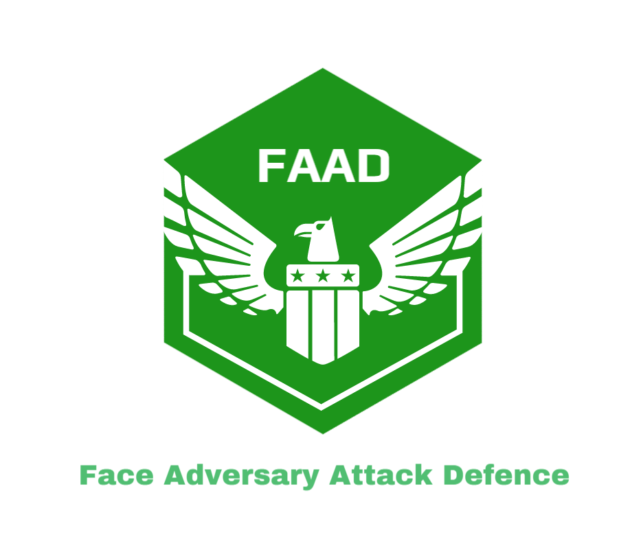

# Face Adversary Attack Defense System

<div align="center"></div>
<br>

      [](https://elainexhzhong.github.io/)

## Inspiration

The code is heavily inspired by the [AmI](https://github.com/Gwinhen/AmI) implementation and [cleverhans](https://github.com/cleverhans-lab/cleverhans) implementation.

## System Architecture

- Creating Secure REST API in Node.js (run a very simple HTTP server) to provide online services to have public-facing APIs.
- Using child_process module of Node.js to spawn subprocesses of command by batch (.bat).
- Switching conda virtual environment and programs by batch. 
- Every GET request to the Node.js server will get corresponding result by a HTML page.
<div align="center"></div>

## API Overview

| API No.  |          API              |   Method  |                      Functionality                          |
|:--------:|:-------------------------:|:---------:|-------------------------------------------------------------|
|    1    |`/facenet?{attack}&{victim}`|    GET    | implement face verification between attacker's face and victim's face |
|    2    |          `/adv`            |    GET    | implement fgsm attack between attacker's face and victim's face and then implement face verification|
|    3    |          `/detect`         |    GET    | implement adversary detection between attacker's face and victim's face and give result |

There are four sub-folders under `/demo` which are: `photo`, `origin`, `adv`, `detect`. 

| folder  |                  Content                          | Changed by API |
|:-------:|:-------------------------------------------------:|:-------------:|
| photo   | original face images of attacker and victim       |      NaN      |
| origin  | facenet verification result plot                  |`/facenet?{attack}&{victim}`|
| adv     | attacker's face with adversarial noise and facenet verification result plot |`/adv`|
| detect  | adversary detection result plot                   |   `/detect`   |

## Prerequisite

* Please download [VGG-Face caffe model](http://www.robots.ox.ac.uk/~vgg/software/vgg_face/) and unzip the model under `model/` folder.

* Please download facenet pre-trained model [20180402-114759](https://drive.google.com/open?id=1EXPBSXwTaqrSC0OhUdXNmKSh9qJUQ55-) and unzip the model under `model/` folder.

## Compile Caffe

As we use VGG-Face caffe model to detect adversary, so we need to compile caffe before detecting adversary. Please click [here](notes/caffe.md) to compile.

| Environment | Purpose |
|----------|--------|
| Visual Studio 2015 + Anaconda env(python 3.5) + CUDA 8.0 + cuDNN 5 | Compile caffe for detecting adversary |
| Visual Studio 2015 + Anaconda env(python 3.6) + tensorflow-gpu 1.7.0 + CUDA 9.0 + cuDNN 7.0.5 | For runing face verfication (using gpu) and fgsm attack |
| Visual Studio 2015 + Anaconda env(python 3.5) + tensorflow-gpu 1.7.0 + CUDA 9.0 + cuDNN 7.0.5 | For runing detection part (using gpu) |
| Visual Studio 2015 + Anaconda env(python 3.5) + tensorflow 1.7.0 + CUDA 9.0 + cuDNN 7.0.5 | For runing detection part (using cpu) |

## Configure Project Environment

### Add system path
```markdown
C:\Program Files\NVIDIA GPU Computing Toolkit\CUDA\v9.0\bin
C:\Program Files\NVIDIA GPU Computing Toolkit\CUDA\v9.0\libnvvp
C:\Program Files\NVIDIA GPU Computing Toolkit\CUDA\v9.0\lib\x64
C:\Program Files\NVIDIA GPU Computing Toolkit\CUDA\v9.0\include
C:\Program Files\NVIDIA GPU Computing Toolkit\CUDA\v9.0\extras\CUPTI\lib64
C:\Program Files\NVIDIA Corporation\NVSMI
C:\Program Files\NVIDIA Corporation\NVIDIA NvDLISR
C:\Program Files (x86)\NVIDIA Corporation\PhysX\Common
$nvcc -V            # to see if GPU is configured successfully
$vidia-smi.exe -l 1 # update GPU information every second
```

### Create conda environment

#### for facenet verification & fgsm attack
```bash
$conda create -n attack python=3.6
$conda activate attack
$pip install -r requirements.txt
$pip install cleverhans==3.0.1 tensorflow-gpu==1.7.0 scikit-learn opencv-python numpy==1.16.2 scipy==1.2.1 matplotlib==3.1.1 Pillow pytest-shutil
$python origin\origin.py Elon_Musk Jeff_Bezos
$python adv/fgsm.py
```

#### for detecting adversary
```bash
$conda create -n detect python=3.5
$conda activate detect
$pip install scikit-image scipy==1.2.1 opencv-python scikit-learn matplotlib Pillow tensorflow-gpu==1.7.0 protobuf==3.4.0
$conda install protobuf
# copy caffe\python\caffe to conda_virtual_env\Lib\site-packages
$python detect/detect.py
```

#### Package environment
```bash
$pip freeze > requirements.txt
$conda env export > environment.yaml
# $conda activate xx && $pip install -r requirements.txt
# $conda env create -f environment.yaml
```

## Run Project

Firstly, run Node.js server by the following command to start the http server:
```bash
$npm install
$node server.js
```

Secondly, open web browser to send your GET requests as follows:
```
http://127.0.0.1:3000/facenet?Elon_Musk&Jeff_Bezos
http://127.0.0.1:3000/adv
http://127.0.0.1:3000/detect
```
## Maintainers

[@ElaineZhong](https://github.com/ElaineXHZhong)

## Contribute

Contributions are always welcome! Feel free to dive in! 

Please read the [contribution guideline](https://github.com/github/docs/blob/main/CONTRIBUTING.md) first, then [open an issue](https://github.com/ElaineXHZhong/Content-Sentiment-Analysis/issues/new) open an issue</a> or submit PRs.

This repository follows the [Contributor Covenant](http://contributor-covenant.org/version/1/3/0/) Code of Conduct.


### Contributors

This project exists thanks to all the people who contribute. 


## License

[MIT](LICENSE) © Elaine Zhong